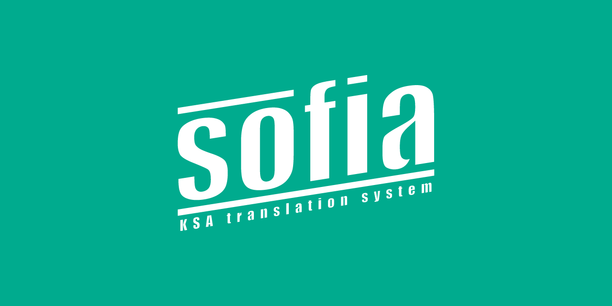

# Sofia, the Chatbot

## What is Sofia, the Chatbot?

**Sofia, the Chatbot** serves as the backend for the *[Kakaotalk](https://www.kakaocorp.com/page/service/service/KakaoTalk)* channel [Sofia: KSA translation system](https://pf.kakao.com/_xocQIxb). Sofia automatically assigns translation tasks created by managers to participants. After completing the tasks, participants can conveniently report their performance through *KakaoTalk*. **Sofia, the Chatbot** also supports a web dashboard, so managers can easily manage the entire project. 

### Who are the participants and managers?

Participants and managers are individuals who involved in the Sofia project. Participants are responsible for completing translation tasks assigned by managers, while managers oversee the project's progress and manage tasks and participants. The permissions provided to the two groups are different.

### What they can do?

Below are things participants can do:

* Task Management
    * Check new tasks.
    * Report the completed tasks.
* Convenience features
    * Check every completed tasks and overall performances.
    * Estimate rewards that you would receive.
    * Access to online translation guidelines to keep translations consistent.

Additionally, here are the detailed features of Sofia for managers:

* Task Management
    * Create and remove new tasks.
    * Automatic or manual assign of new tasks.
* Participant Management
    * Approve or reject new participants.
    * Issue or cancel warnings.
    * Promote to manager.
* System Management
    * Generate translation performance report.
    * Update online translation guidelines.

## Disclaimer

Key languages that made this project are the followings:

* Server side
    * PHP, *as the KSA council server does not supports the others*
* Client side
    * Bootstrap, *for nice layout*
    * jQuery, *for client-side interactions*

This project was launched in 2019 to serve the [Korea Science Academy(KSA) of KAIST](https://ksa.hs.kr/)'s student council, and has undergone approximately 20 updates since then. With the release of the final patch 1.20, Sofia's server was transferred to the KSA Student Council and is now operational without my technical support. This repository is the 1.20 version of Sofia source code, but the following points are different from the source code currently in service.

* ➕**Add**: **MORE COMMENTS**. As this is my second official web project I made, the code is not pretty, so I added a lot of comments.
* ➖**Removed**: Codes with security and license issues have been removed.